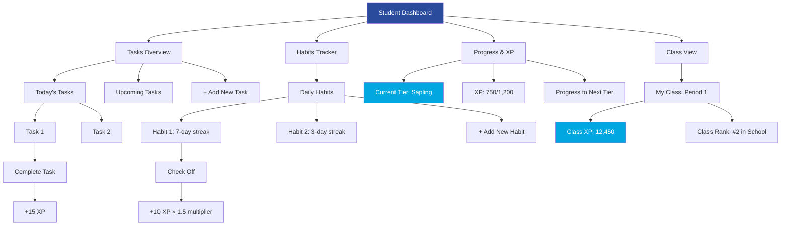

```mermaid
graph TD
    A[Student Dashboard] --> B[Tasks Overview]
    A --> C[Habits Tracker]
    A --> D[Progress & XP]
    A --> E[Class View]
    
    B --> F[Today's Tasks]
    B --> G[Upcoming Tasks]
    B --> H[+ Add New Task]
    
    F --> I[Task 1]
    F --> J[Task 2]
    
    I --> K[Complete Task]
    K --> L[+15 XP]
    
    C --> M[Daily Habits]
    M --> N[Habit 1: 7-day streak]
    M --> O[Habit 2: 3-day streak]
    M --> P[+ Add New Habit]
    
    N --> Q[Check Off]
    Q --> R[+10 XP × 1.5 multiplier]
    
    D --> S[Current Tier: Sapling]
    D --> T[XP: 750/1,200]
    D --> U[Progress to Next Tier]
    
    E --> V[My Class: Period 1]
    V --> W[Class XP: 12,450]
    V --> X[Class Rank: #2 in School]
    
    style A fill:#2A4B9B,color:white
    style S fill:#00A7E1,color:white
    style W fill:#00A7E1,color:white
```
