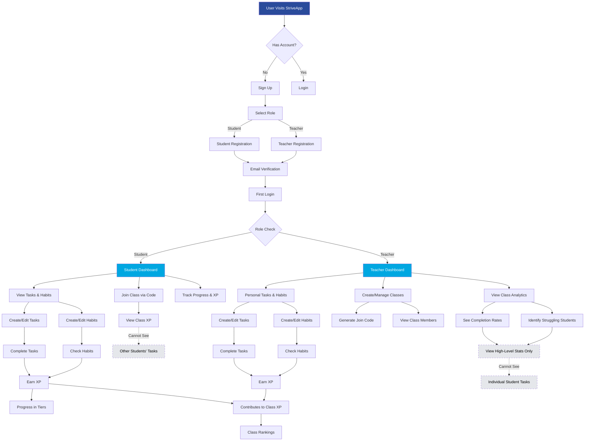

```mermaid
graph TD
    %% Authentication Flow
    A[User Visits StriveApp] --> B{Has Account?}
    B -->|No| C[Sign Up]
    B -->|Yes| D[Login]
    C --> E[Select Role]
    E -->|Student| F[Student Registration]
    E -->|Teacher| G[Teacher Registration]
    F --> H[Email Verification]
    G --> H
    H --> I[First Login]
    
    %% Role-Based Redirection
    I --> J{Role Check}
    J -->|Student| K[Student Dashboard]
    J -->|Teacher| L[Teacher Dashboard]
    
    %% Student Flow
    K --> M[View Tasks & Habits]
    K --> N[Join Class via Code]
    K --> O[Track Progress & XP]
    M --> P[Create/Edit Tasks]
    M --> Q[Create/Edit Habits]
    P --> R[Complete Tasks]
    Q --> S[Check Habits]
    R --> T[Earn XP]
    S --> T
    T --> U[Progress in Tiers]
    N --> V[View Class XP]
    
    %% Teacher Flow
    L --> W[Personal Tasks & Habits]
    L --> X[Create/Manage Classes]
    L --> Y[View Class Analytics]
    W --> Z[Create/Edit Tasks]
    W --> AA[Create/Edit Habits]
    Z --> AB[Complete Tasks]
    AA --> AC[Check Habits]
    AB --> AD[Earn XP]
    AC --> AD
    X --> AE[Generate Join Code]
    X --> AF[View Class Members]
    Y --> AG[See Completion Rates]
    Y --> AH[Identify Struggling Students]
    
    %% Data Visibility
    AG --> AI[View High-Level Stats Only]
    AH --> AI
    AI -.->|Cannot See| AJ[Individual Student Tasks]
    V -.->|Cannot See| AK[Other Students' Tasks]
    
    %% Class XP Contribution
    T --> AL[Contributes to Class XP]
    AD --> AL
    AL --> AM[Class Rankings]
    
    style A fill:#2A4B9B,color:white
    style K fill:#00A7E1,color:white
    style L fill:#00A7E1,color:white
    style AI fill:#E5E7EB,color:black,stroke-dasharray: 5 5
    style AJ fill:#E5E7EB,color:black,stroke-dasharray: 5 5
    style AK fill:#E5E7EB,color:black,stroke-dasharray: 5 5
```
