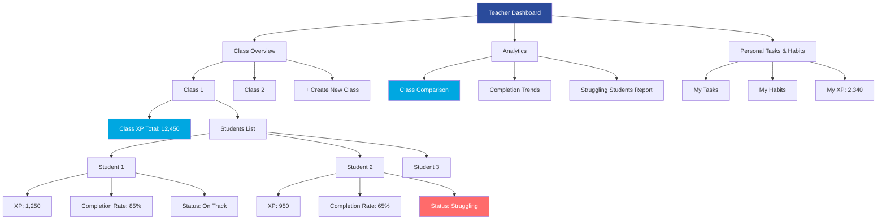

```mermaid
graph TD
    A[Teacher Dashboard] --> B[Class Overview]
    A --> C[Personal Tasks & Habits]
    A --> D[Analytics]
    
    B --> E[Class 1]
    B --> F[Class 2]
    B --> G[+ Create New Class]
    
    E --> H[Class XP Total: 12,450]
    E --> I[Students List]
    
    I --> J[Student 1]
    I --> K[Student 2]
    I --> L[Student 3]
    
    J --> M[XP: 1,250]
    J --> N[Completion Rate: 85%]
    J --> O[Status: On Track]
    
    K --> P[XP: 950]
    K --> Q[Completion Rate: 65%]
    K --> R[Status: Struggling]
    
    D --> S[Class Comparison]
    D --> T[Completion Trends]
    D --> U[Struggling Students Report]
    
    C --> V[My Tasks]
    C --> W[My Habits]
    C --> X[My XP: 2,340]
    
    style A fill:#2A4B9B,color:white
    style R fill:#FF6B6B,color:white
    style H fill:#00A7E1,color:white
    style S fill:#00A7E1,color:white
```
